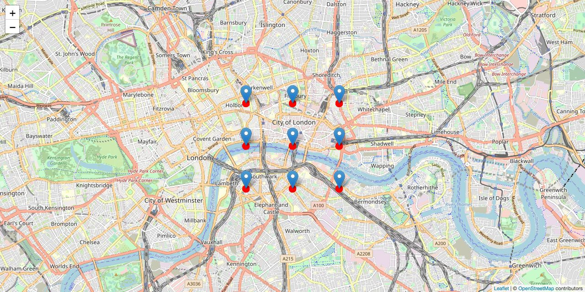

# deck.gl-leaflet

[](https://www.npmjs.com/package/deck.gl-leaflet)
[](https://www.npmjs.com/package/deck.gl-leaflet)
[](https://www.npmjs.com/package/deck.gl-leaflet)

deck.gl plugin for Leaflet

[Demo](https://zakjan.github.io/deck.gl-leaflet/)



## Install

```
npm install deck.gl-leaflet
```

or

```
<script src="https://unpkg.com/deck.gl-leaflet@1.0.4/dist/deck.gl-leaflet.min.js"></script>
```

## Usage

```
import { LeafletLayer } from 'deck.gl-leaflet';
```

```
const map = L.map(...);
const deckLayer = new LeafletLayer({
  views: [
    new MapView({
      repeat: true
    })
  ],
  layers: [
    new ScatterplotLayer({
      data: [...],
    })
  ]
});
map.addLayer(deckLayer);
```